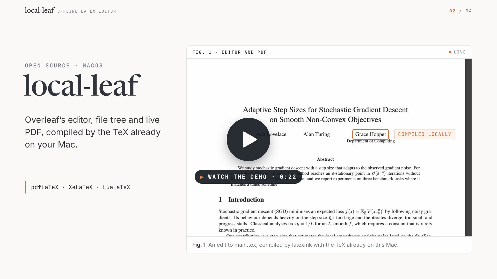
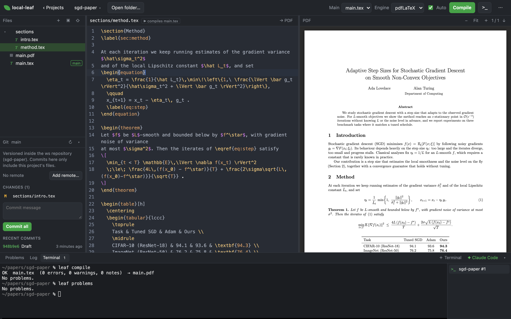

# local-leaf: an offline Overleaf alternative for your Mac

[](LICENSE)


local-leaf is a free, open-source LaTeX editor that looks and works like Overleaf but runs on your
own Mac and compiles with the TeX distribution you already have (MacTeX, `latexmk`). Point it at a
folder of `.tex` files, edit in the browser, and get a live PDF with SyncTeX jumping in both
directions. No account, no upload, no compile timeout, and it keeps working offline.

Files stay on disk, so git, your terminal and AI coding agents such as Claude Code or Codex can
work on the same project and the editor picks up every change live. The `leaf` command line lets an
agent open, compile and read errors exactly as you see them.

[](https://local-leaf.aneeshiyer.com/#demo)

<p align="center"><sub>▶ <a href="https://local-leaf.aneeshiyer.com/#demo">Watch the 22-second demo</a> (with sound) · <a href="docs/demo.mp4">download the MP4</a></sub></p>

## Features



- **Editor:** CodeMirror 6 with LaTeX highlighting, spellcheck, find/replace, and completions for
  commands, environments, `\ref` labels and `\cite` keys.
- **Compile:** `latexmk` with pdfLaTeX, XeLaTeX or LuaLaTeX. Auto-compiles when files change on
  disk. Parsed errors and warnings with file:line, click to jump. Selecting a standalone `.tex`
  file compiles that file; included files compile the main document.
- **PDF:** pdf.js viewer with SyncTeX both ways (⌘⇧J from the editor, ⌘-click in the PDF).
- **Projects:** a home page listing every project in your workspace folder, with import from a
  folder, a `.zip`, or Overleaf.
- **Git:** per-project commit, push and pull from a panel in the sidebar, or publish to GitHub.
- **Terminal:** an integrated, VS Code-style terminal panel that opens in the project folder, with
  a one-click **Claude Code** launcher for AI help on the document.
- **CLI:** `leaf` drives everything from a shell, for you or for an agent.

## local-leaf compared with Overleaf

| | Overleaf (overleaf.com) | local-leaf |
| --- | --- | --- |
| Where your files live | Overleaf's servers | A folder on your Mac |
| What compiles them | Overleaf's TeX Live, with a compile time limit | Your own TeX distribution, no time limit |
| Works offline | No | Yes |
| Git and GitHub | Git access and GitHub sync on paid plans | Commit, push, pull and publish to GitHub from the sidebar, free |
| AI agents and scripts | Browser only | `leaf` CLI plus an integrated terminal with a Claude Code launcher |
| Real-time collaboration | Yes | No: one user, share through git |
| Price | Free tier and paid plans | Free, MIT licensed |

Moving over is one step: import a project from a `.zip` or straight from Overleaf's git URL (see
[Importing from Overleaf](#importing-from-overleaf)).

**Other options.** [Overleaf Community Edition](https://github.com/overleaf/overleaf) is the full
multi-user Overleaf server you self-host with Docker; local-leaf is one Node process with no Docker
and no accounts. VS Code with [LaTeX Workshop](https://github.com/James-Yu/LaTeX-Workshop) suits
people who already live in VS Code; local-leaf keeps Overleaf's layout, shortcuts and Overleaf import
in a browser tab.

## Requirements

- macOS with a TeX distribution that provides `latexmk` and `synctex` (MacTeX puts them in `/Library/TeX/texbin`).
- Node.js 18 or newer.

## Run

```bash
npm install
npm start
```

This builds the client bundle, starts the server on http://localhost:3737 (bound to localhost only)
and opens it in your default browser. Pass a folder to open it directly, or `--no-open` to skip
launching the browser:

```bash
node server/index.js ~/Documents/my-paper
```

With no argument, the most recently opened project is reopened. Set `PORT` to change the port.

## Where your projects live

Projects are folders inside one **workspace** folder. By default that is `projects/` inside this
repository, which `.gitignore` keeps out of local-leaf's own git history. To version your documents
separately, point the workspace at a folder that is its own (private) git repository:

```bash
git clone git@github.com:you/my-latex-projects.git ~/Documents/my-latex-projects
leaf workspace ~/Documents/my-latex-projects
```

or use **Change folder…** on the home page. The Git panel then commits each project's files into
that repository and pushes them wherever it points, while this repo stays clean and shareable. The
`LOCAL_LEAF_PROJECTS` environment variable overrides the setting for one run.

## Importing from Overleaf

Two ways, depending on your Overleaf plan:

1. **Zip export (any plan).** In Overleaf open the project, then **Menu → Download → Source** to get
   a `.zip`. In local-leaf choose **Upload .zip…** (project menu or welcome screen). The zip is
   extracted into a new folder under `projects/`.
2. **Git sync (paid Overleaf plans).** Overleaf exposes each project as a git repository. Generate a
   git token under **Account settings → Git integration** on overleaf.com, then in local-leaf choose
   **Import from Overleaf…** and paste the project URL from your address bar. The project is cloned
   into the workspace and detached from Overleaf: its nested git metadata is dropped and the files
   become part of the workspace repository, so the Git panel commits and pushes them to your own
   remote from then on. From the terminal: `leaf overleaf token <token>` then `leaf overleaf import <url>`.
   The Overleaf project id is remembered in the workspace repo's git config
   (`leaf.overleaf.<folder>`) in case you ever want to look the original up again.

The token lives only in `~/.local-leaf/overleaf-token` (mode 600) and is passed to git through an
askpass helper, never embedded in a URL. Replace or clear it from the ⋯ menu → **Overleaf git token…**
or with `leaf overleaf token --clear`.

## Version control

The **Git** panel at the bottom of the sidebar works on the open project. If the workspace folder
is a git repository (see "Where your projects live"), every project is versioned inside it:

- The panel lists changed files under the project (click to open) with a commit message box.
  **Commit all** stages and commits only that project's files, never the rest of that repo.
  **Commit & push** does both. **Push** and **Pull** sync the repository with GitHub, and the
  ahead/behind counts come from the last fetch.
- Commits use your global git identity. Pushes use the credentials git already has on this Mac
  (the `gh` login or SSH keys); the app never asks for passwords.
- A project that is its own repository (moved in with a `.git` folder, or opened in place outside
  the workspace) is handled on its own: the panel offers **Initialize repository**, **Publish to
  GitHub…** and **Add remote…**, and an enclosing repo leaves that folder alone. Copies and
  Overleaf imports drop any nested `.git` so they join the workspace repository.

## Terminal and Claude Code in a project

The bottom panel has a **Terminal** tab, VS Code style: press ⌃` or the **>_** button to open a
shell that starts in the open project's folder, running inside the page. Open as many as you like;
they are listed on the right of the panel and keep running while you switch tabs or reload the page.
**✦ Claude Code** opens a terminal that starts `claude` in the project, so you can ask it to work on
the document while the editor and PDF update live (it reads `CLAUDE.md`, which explains the `leaf`
compile loop; other agents read the same notes from `AGENTS.md`). Drag the panel's top edge to resize it.

The integrated terminal needs `node-pty`, which `npm install` builds for your machine. If it ever
fails to load, the ⋯ menu still offers **Open in Terminal.app** and **Open Claude Code in
Terminal.app** as external fallbacks (`leaf terminal [--claude]` from a shell).

## Command line (for you or a terminal agent)

`bin/leaf.js` drives the running server, so a terminal session or an agent such as Claude Code
sees and controls exactly what the browser shows. Put it on your PATH once with:

```bash
npm link
```

Then, with the server running (`leaf serve --detach` starts it in the background):

```bash
leaf projects                 # workspace projects and other recent folders
leaf open thesis              # open a project by name (or any folder by path)
leaf root                     # absolute path of the open project, for editing files directly
leaf compile                  # compile, wait, print errors/warnings; exit code 1 on failure
leaf problems --errors        # errors from the last compile with file:line
leaf log | leaf output        # full .log / raw latexmk output
leaf set engine xelatex       # also: set main <file>, set auto on|off
leaf synctex main.tex:42      # where a line lands in the PDF
leaf git status               # also: log, init, commit -m "…", push, pull, publish, remote <url>
leaf events                   # stream file-change and compile events as JSON lines
leaf help                     # full list; --json on any command for machine-readable output
```

`AGENTS.md` (imported by `CLAUDE.md`) tells Claude Code, Codex and other coding agents how to use this loop.

## Keyboard shortcuts

Overleaf's editor shortcuts work here too (⌘ is Ctrl on a PC keyboard). Formatting shortcuts wrap
the selection, or insert the command with the cursor inside when nothing is selected.

| Keys | Action |
| --- | --- |
| ⌘S | Save |
| ⌘↩ | Compile |
| ⌘B / ⌘I / ⌘E | `\textbf{}` / `\textit{}` / `\emph{}` |
| ⌘⇧T | `\texttt{}` |
| ⌘⇧M | Inline math `$…$` |
| ⌘⇧E / ⌘⇧I | Wrap in an `equation` / `itemize` environment |
| ⌘/ | Toggle `%` comment |
| ⌘U / ⌘⇧U | Uppercase / lowercase selection or word |
| ⌘D / ⌘⇧D | Delete / duplicate line |
| ⌘F | Find and replace |
| ⌥G | Go to line |
| ⌘⇧J | Jump from cursor to PDF |
| ⌘-click / double-click PDF | Jump from PDF to source |
| ⌃` | Toggle the terminal panel |

## FAQ

### Is there an offline version of Overleaf?

Overleaf itself needs a connection, and its self-hosted Community Edition needs Docker. local-leaf
gives you an Overleaf-style editor (file tree, source, live PDF, SyncTeX, the same shortcuts) that
runs entirely on your Mac and compiles with MacTeX, so it works on a plane.

### How do I move a project from Overleaf to my Mac?

In Overleaf use **Menu → Download → Source**, then **Upload .zip…** in local-leaf. On a paid
Overleaf plan you can instead paste the project URL into **Import from Overleaf…** and it is cloned
over git. Details in [Importing from Overleaf](#importing-from-overleaf).

### Can Claude Code or another AI agent edit my LaTeX paper?

Yes, and you watch it happen. Open the terminal panel and press **✦ Claude Code**, or run any agent
in the project folder. It edits the `.tex` files directly, runs `leaf compile`, reads `leaf problems`
for errors with file and line, and the editor and PDF update live. `AGENTS.md` and `CLAUDE.md` teach
the agent that loop.

### Which TeX engines and bibliography tools work?

pdfLaTeX, XeLaTeX and LuaLaTeX through `latexmk`, which also runs BibTeX or Biber when your document
needs them. `\cite` completions come from the `.bib` files in the project.

### Do I need MacTeX?

You need a TeX distribution that provides `latexmk` and `synctex`. MacTeX puts them in
`/Library/TeX/texbin`, which is where local-leaf looks; with BasicTeX, add `latexmk` through
`tlmgr install latexmk`.

### Does it run on Windows or Linux?

It is macOS-first today. The server is plain Node, so small portability patches are welcome; see
[CONTRIBUTING.md](CONTRIBUTING.md).

### Can other people reach my editor?

No. The server binds to `127.0.0.1` only. See [Security](#security).

## Layout

```
server/   Express + WebSocket backend: file API, latexmk runner, log parser, SyncTeX, file watcher
client/   Browser app: CodeMirror 6 editor, pdf.js viewer, file tree
public/   Static shell and the built bundle (public/build, generated)
```

`npm run dev` rebuilds the client on change without reopening the browser.

## Security

The server binds to `127.0.0.1` only and has no authentication. It reads and writes files in your
projects, runs `latexmk` and `git`, and the integrated terminal runs a shell as you. Never expose
the port to other machines (no port forwarding, no `0.0.0.0`). Tokens for Overleaf are stored in
`~/.local-leaf/` with owner-only permissions.

## License

MIT. See [LICENSE](LICENSE).
